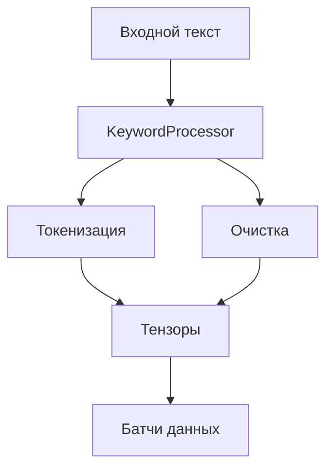
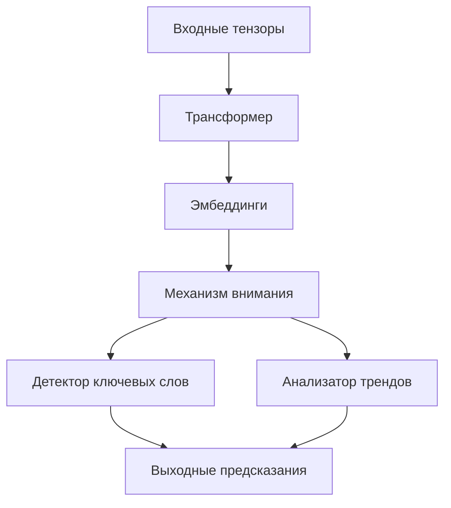
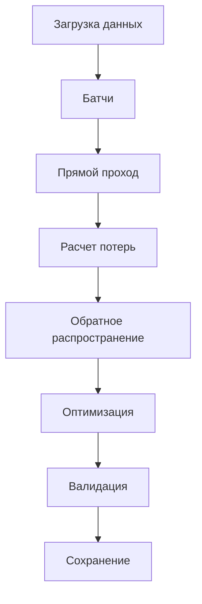
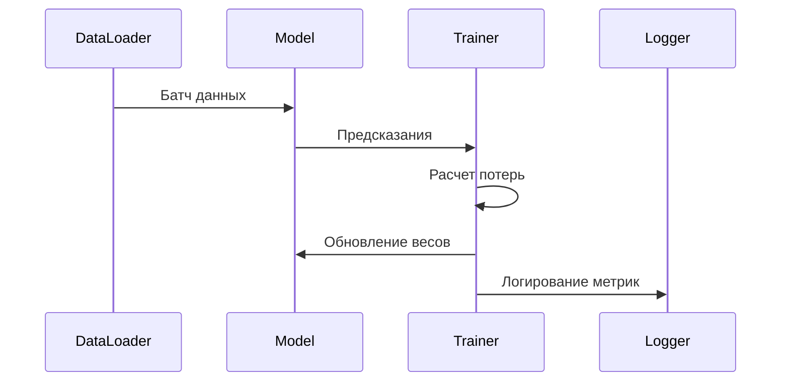
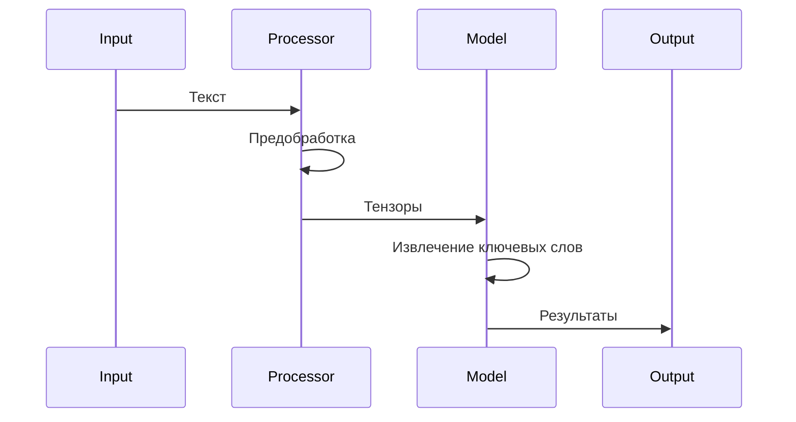
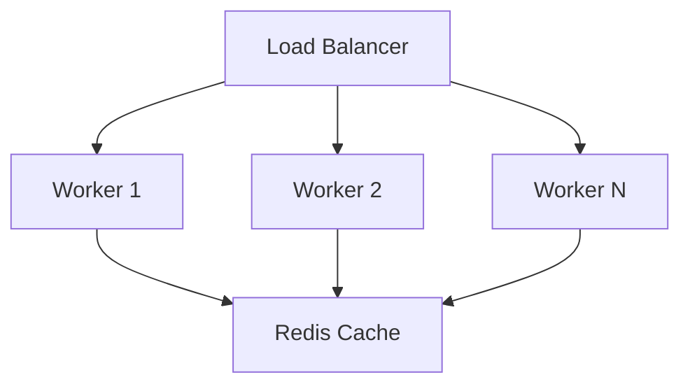
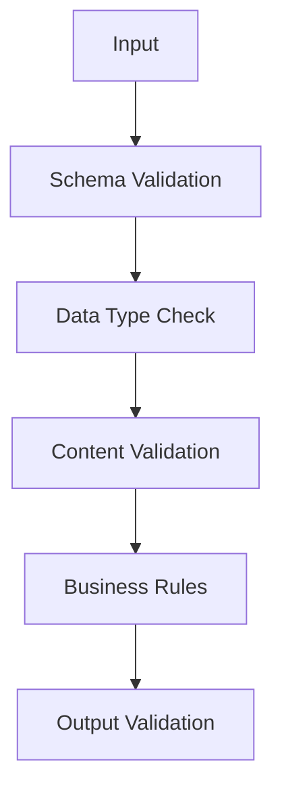
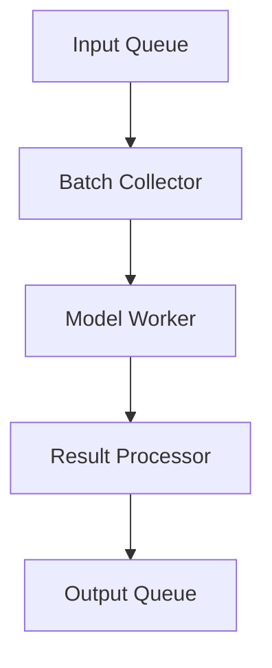
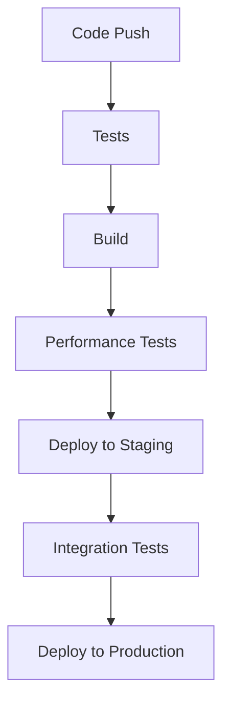

# Архитектура модуля

## Общая структура

```
model/
├── config/              # Конфигурации
│   ├── model_config.py  # Параметры модели
│   └── logging_config.py# Настройки логирования
│
├── model/              # Основные компоненты
│   ├── processor.py    # Обработка текста
│   ├── model.py       # Основная модель
│   └── trainer.py     # Обучение
│
├── monitoring/         # Мониторинг
│   ├── logger.py      # Логирование
│   └── performance.py # Производительность
│
├── utils/             # Утилиты
│   ├── data_utils.py  # Работа с данными
│   ├── metrics.py     # Метрики
│   └── visualization.py# Визуализация
│
└── tests/            # Тесты
```

## Компоненты системы

### 1. Обработка данных



### 2. Архитектура модели



### 3. Процесс обучения



## Основные интерфейсы

### Обработка текста

```python
class TextProcessor(Protocol):
    def preprocess(self, text: str) -> str: ...
    def tokenize(self, text: str) -> List[str]: ...
    def encode(self, tokens: List[str]) -> torch.Tensor: ...
    def decode(self, tensor: torch.Tensor) -> List[str]: ...
```

### Модель

```python
class KeywordModel(Protocol):
    def encode(self, x: torch.Tensor) -> torch.Tensor: ...
    def decode(self, z: torch.Tensor) -> torch.Tensor: ...
    def extract_keywords(self, text: str) -> List[str]: ...
```

### Тренер

```python
class Trainer(Protocol):
    def train_step(self, batch: Dict[str, torch.Tensor]) -> Dict[str, float]: ...
    def validate(self, dataloader: DataLoader) -> Dict[str, float]: ...
    def save_checkpoint(self, path: Path) -> None: ...
```

## Потоки данных

### 1. Обучение



### 2. Предсказание



## Конфигурация системы

### 1. Модель

```yaml
model:
  name: xlm-roberta-base
  max_length: 512
  hidden_dim: 256
  num_heads: 8
  dropout: 0.1
```

### 2. Обучение

```yaml
training:
  batch_size: 32
  learning_rate: 1e-4
  epochs: 10
  warmup_steps: 1000
```

### 3. Инференс

```yaml
inference:
  threshold: 0.5
  batch_size: 64
  max_keywords: 10
```

## Масштабирование

### Горизонтальное масштабирование



### Вертикальное масштабирование

- Оптимизация батчей
- Использование mixed precision
- Распределенное обучение

## Мониторинг и метрики

### 1. Производительность

- Время обработки батча
- Использование памяти
- Загрузка CPU/GPU
- Пропускная способность
- Latency распределение

### 2. Качество модели

- Точность извлечения ключевых слов
- Полнота выделения
- F1-мера
- ROC-AUC для определения ключевых слов
- Корреляция с экспертными оценками

### 3. Бизнес-метрики

- Количество обработанных текстов
- Среднее число ключевых слов на текст
- Распределение оценок уверенности
- Время отклика API

## Обработка ошибок

### 1. Уровни валидации



### 2. Обработчики ошибок

```python
class ErrorHandler:
    def handle_input_error(self, error: InputError) -> Response: ...
    def handle_processing_error(self, error: ProcessingError) -> Response: ...
    def handle_model_error(self, error: ModelError) -> Response: ...
```

### 3. Логирование ошибок

```python
@error_handler
def process_text(text: str) -> List[str]:
    try:
        # Processing logic
        pass
    except Exception as e:
        logger.error(f"Processing error: {e}", extra={
            'text_length': len(text),
            'error_type': type(e).__name__
        })
        raise
```

## Безопасность

### 1. Валидация входных данных

- Проверка длины текста
- Санитизация ввода
- Ограничение запросов
- Проверка форматов

### 2. Аутентификация и авторизация

```python
class SecurityMiddleware:
    def authenticate(self, request: Request) -> User: ...
    def authorize(self, user: User, resource: str) -> bool: ...
    def rate_limit(self, user: User) -> bool: ...
```

### 3. Защита данных

- Шифрование чувствительных данных
- Изоляция окружений
- Аудит доступа
- Безопасное хранение моделей

## Интеграция

### 1. REST API

```yaml
endpoints:
  /extract_keywords:
    post:
      parameters:
        - text: string
        - options: object
      responses:
        200:
          description: Successful extraction
        400:
          description: Invalid input
```

### 2. Batch Processing



### 3. Event Driven

```python
class EventProcessor:
    @event_handler('new_document')
    def process_document(self, event: Event) -> None:
        # Process document
        pass

    @event_handler('model_updated')
    def reload_model(self, event: Event) -> None:
        # Reload model
        pass
```

## Развертывание

### 1. Docker контейнеры

```dockerfile
FROM python:3.8-slim

WORKDIR /app
COPY requirements.txt .
RUN pip install -r requirements.txt

COPY . .
CMD ["uvicorn", "model.api:app"]
```

### 2. Kubernetes

```yaml
apiVersion: apps/v1
kind: Deployment
metadata:
  name: keyword-extractor
spec:
  replicas: 3
  template:
    spec:
      containers:
      - name: model-server
        image: keyword-extractor:latest
        resources:
          limits:
            memory: "4Gi"
            nvidia.com/gpu: 1
```

### 3. CI/CD Pipeline



## Расширение функциональности

### 1. Плагинная система

```python
class PluginManager:
    def register_plugin(self, name: str, plugin: Plugin) -> None: ...
    def get_plugin(self, name: str) -> Plugin: ...
    def list_plugins(self) -> List[str]: ...
```

### 2. Кастомные компоненты

```python
@register_component
class CustomKeywordDetector(BaseDetector):
    def __init__(self, config: Config):
        super().__init__(config)
        
    def detect(self, text: str) -> List[str]:
        # Custom detection logic
        pass
```

### 3. Поддержка новых языков

- Подключение языковых моделей
- Настройка токенизации
- Добавление специфичных правил

## Перспективы развития

### 1. Улучшение модели

- Поддержка новых архитектур
- Дистилляция моделей
- Квантизация
- Pruning

### 2. Оптимизация

- Кэширование
- Векторизация
- JIT-компиляция
- Параллельная обработка

### 3. Новые возможности

- Классификация ключевых слов
- Анализ тематик
- Извлечение сущностей
- Генерация рекомендаций
